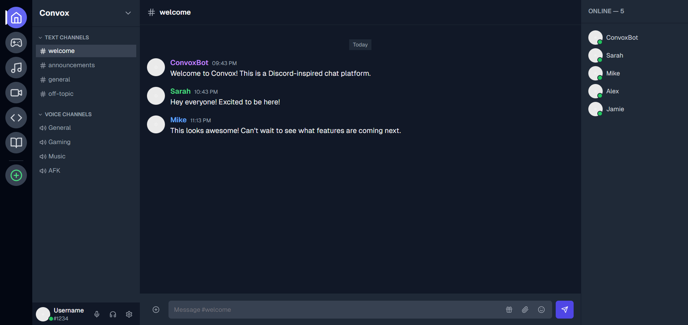

# 🧭 Convox – Real-Time Chat Platform

**Convox** is a modern, lightweight chat application inspired by Discord. Built with **ASP.NET Core** and **Vue.js**, it delivers seamless real-time messaging and peer-to-peer voice calls, perfect for teams, friends, or gaming communities.




## ✨ Features

- 🔐 **User Authentication**: Secure registration and login with JWT.
- 💬 **Real-time Messaging**: Instant message delivery with low latency via SignalR.
- 📁 **Channel-based Conversations**: Create public or private channels for group chats.
- 📞 **P2P Voice Calls**: High-quality, secure voice calls powered by WebRTC.
- 👤 **User Profiles**: Customize profiles with avatars and personal details.
- 🔔 **Live Notifications**: Get instant alerts for new messages.
- 🧱 **Scalable Architecture**: Modular design for easy feature expansion.

## 🧰 Tech Stack

- **Frontend**: Vue.js, TypeScript, Pinia, Bootstrap
- **Backend**: ASP.NET Core Web API, SignalR
- **Authentication**: JWT (JSON Web Token)
- **Voice Calls**: WebRTC
- **Database**: SQL Server
- **Deployment**: Docker, Vercel (Frontend), Azure/Render (Backend)

## 📊 Project Status

Convox is currently in **beta**. Features like video calls and AI integrations are planned for future releases.

## 📁 Project Structure

- Lynqis/
- ├── client/ # Vue.js frontend
- ├── server/ # ASP.NET Core backend
- ├── docs/ # Documentation and planning
- └── README.md

## 🚀 Getting Started

### Prerequisites

- [.NET 8 SDK](https://dotnet.microsoft.com/download)
- [Node.js & npm](https://nodejs.org/)
- SQL Server
- Visual Studio / VS Code
- Docker
  
### Installation
#### 1. Clone the Repository
```bash
git clone https://github.com/RudeusGs/Convox.git
cd Convox
```
#### 2. Backend
```bash
- cd server
- dotnet restore
- dotnet run
```
- Configure the database connection in appsettings.json.
- Run migrations (if applicable): dotnet ef database update.
#### 3. Frontend
```bash
- cd client
- npm install
- npm run dev
```
- 📸 Screenshots
Add screenshots of your app interface here (coming soon).

- 🛡️ License
This project is licensed under the MIT License – see the LICENSE file for details.

- 🤝 Contributing
Pull requests are welcome!
For major changes, please open an issue first to discuss what you would like to change.
- 📬 Contact
Have questions or suggestions? Reach out via GitHub Issues or connect with us on [Ngô Trần Nguyên Quân](https://www.facebook.com/rudeusgrey198/).

- 🌟 Acknowledgments
Inspired by Discord’s intuitive design.
Built with love using open-source tools and libraries.
